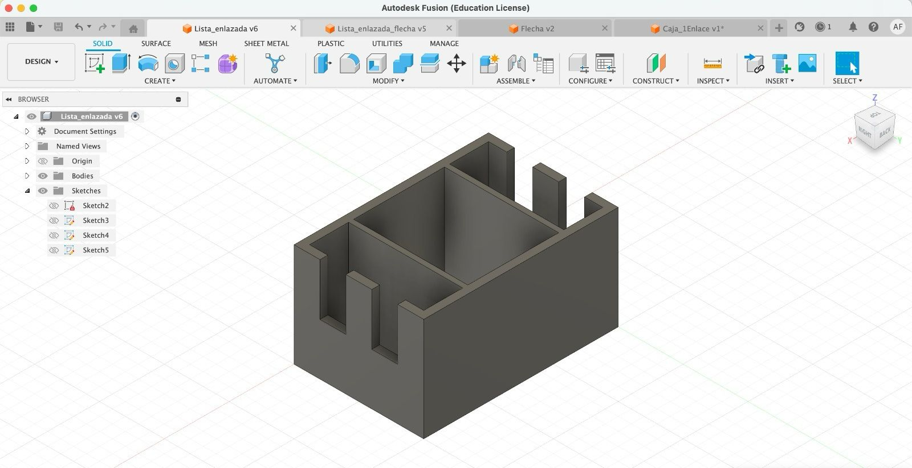
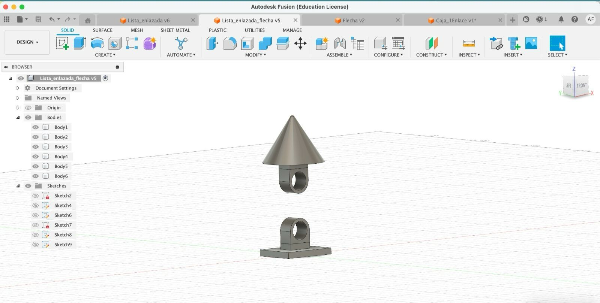
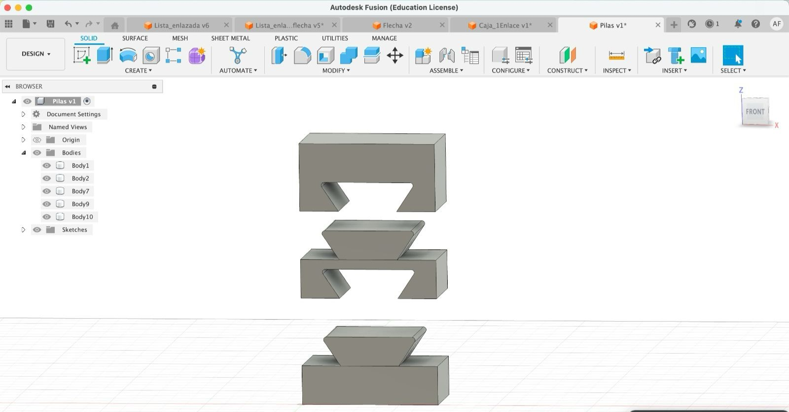
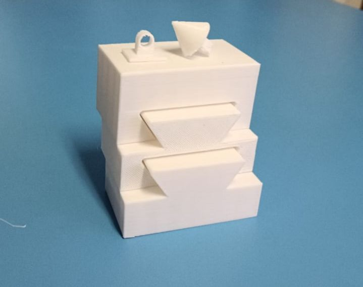

# 3DEstructurasDatos

Lista enlazada | Lista enlazada | Pilas
:-----------------------:|:-----------------------:|:-----------------------:
 |  |  

## Pilas
----------
Los modelos de pilas, consisten de tres piezas distintas. La piezas de head y tail, y las piezas de en medio de la pila. Al imprimir las piezas, le implementamos un 0.2 de tolerancia para que encajaran una con la otra.

""" EXPLICAR COMO PONER LA TOLERANCIA EN FUSION 360 """
**Resultados:**

## Listas y Árboles
--------
Para la creación de listas y árboles, el modelo es reutilizable para ambas estructuras. 

"""" PONER MODELOS DE NODOS Y ENLACES """
